### 业务逻辑

#### 一、登录

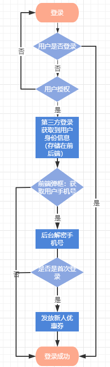

> 1. 当用户没有登录时，会提示他进行登录/注册
> 2. 小程序登录需要获取到微信的登录凭证，需要用户授权
> 3. 获取到微信返回的用户信息（openId、session_key等），身份服务中心生成用户对应的小程序凭证，并返回用户的登录态到前端。
> 4. 同时后台会判断用户是否是首次登录，是就会发放新人券给用户，由于优惠券是另一个服务，身份服务就会生产一个消息发送到RocketMQ中，由优惠券服务去消费这个发放新人券的消息。（这里我们通过RocketMQ降低了服务之间的耦合度，也提升了系统的响应能力）

###### 微信小程序授权流程

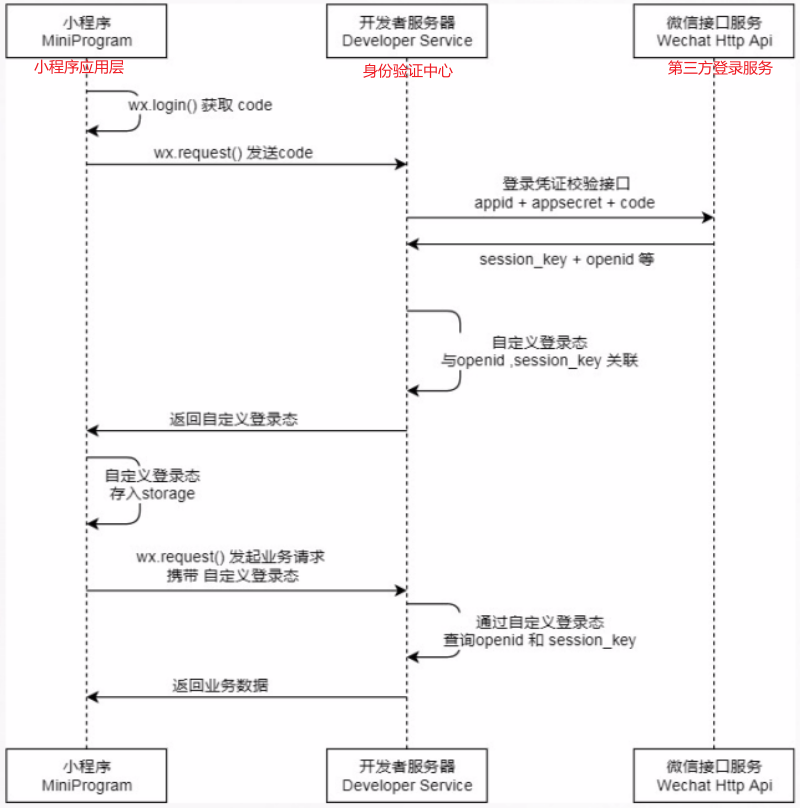

> 登录授权的目的是通过微信官方的登录能力获取微信的用户身份标识，快速建立小程序内的用户体系。
>
> 1. 在获取用户授权的时候，小程序会通过wx.login（）方法获取一个code，并且把它发往开发者服务器，其通过已经申请好的`appid`和`appsecret` 加上这个`code`去向微信接口服务获取对应的`session_key`和`openid`。
> 2. 同时将返回的信息与`openid`，`session_key` 进行管理，返回自定义登录状态。
> 3. 小程序拿到自定义登录状态以后保存在本地的storage中，在每次发起服务端请求的时候，都会携带上这个登录态，开发者服务器也通过这个登录态去查询用户的`openid`和`session_key`，也就是最开始用户授权时生成的信息。在通过验证以后返回业务数据，整个过程保证用户数据传输的安全。

###### 优惠券发放

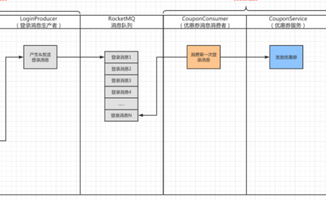

> 消费第一次登录的信息。然后，通过监听该消息，将消息中关于用户和优惠券的信息进行提取并且保存到用户-优惠券关联表中。

###### 重复发券问题

> 生产者重复发送：由于网络抖动，LoginProducer 就发送了两条“登录消息”
>
> 消费者重复消费：当CouponService组件下发优惠券成功后，consumer端返回broker CONSUMER_SUCCESS时网络抖动或者consumer消费消息后故障，导致broker没收到消费成功的响应即消费者提交offset失败。
>
> 当网络恢复或者CouponConsumer重新启动的时候，发现队列指向的offset依旧指着刚才处理的那条“登录消息1”，因此又将该消息处理了一次。因此就造成了在CouponService 中发放了两次优惠券的情况。

我们通过引入redis来保证消息的`幂等性`，利用setnx的函数特性（相当于加上了分布式锁，key不存在，设置）

key=“第一次重复登录”的前缀+用户Id（userId）

Value=用户名（userId）、电话号码（phoneNumber)

1. 当返回成功“SUCCESS”并且data为”FALSE“说明Redis中对应的Key已经有Value 了，也就说明Redis中已经存在这条消息了，消费者已经处理过这条“第一次登录”的记录了。这种情况下，只记录一个日志，而不进行后续的操作。
2. 如果返回的是“SUCCESS”并且data为“true”，说明Redis没有记录这条消息，也就是消费者第一次处理这个消息，那么就需要更新数据库中用户和优惠券的关系，从而完成给用户发放优惠券的操作。

兜底方案：考虑到项目的高可用，若redis宕机，通过数据库中`用户ID和+优惠券ID组成唯一键`（`alter table t_user_coupon add unique index(userId,couponId)`），保证消息幂等。

#### 二、门店信息

> 登录小程序后，有两个入口在线购物和扫码购（线下），在线下购物需要选择门店，一般情况都会去数据库读取门店信息，但考虑到并发性能，我们考虑使用缓存。

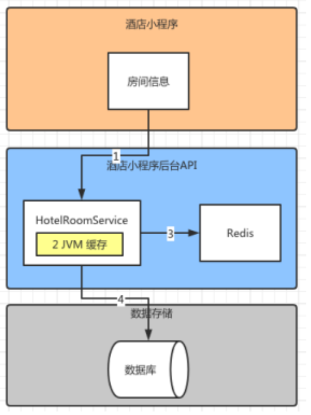

1. 小程序通过后台API获取门店信息。
2. 首先去查询Redis缓存中是否存在门店信息，如果存在，就直接返回给小程序。
3. 如果Redis中不存在信息，再请求数据库，并且返回信息。

###### 多级缓存机制

`引入redis后，将数据从磁盘搬到了内存中，加快了数据的查询效率，在高并发中提高了用户获取数据的速度`

但我们又想到如果并发量再次升级，因为redis是不同的服务，还是存在IO损耗，我们就考虑到本地缓存(JVM缓存，通过ConcurrentHashMap实现)，因为门店信息没有很多，而且也是热点数据，所以蛮适合的存在本地缓存的（占用的内存少，访问频率高），提高了查询效率。

1. 小程序通过后台API获取门店信息。
2. 先查询本地缓存中是否命中，存在就返回。
3. 本地不存在，去查询Redis缓存中是否存在门店信息，如果存在，就直接返回给小程序。
4. 如果Redis中不存在信息，再请求数据库，并且返回信息。

###### 多级缓存带来的问题

> 在写入缓存数据的时候如何保持Redis缓存和JVM本地缓存的一致性呢？如果Redis缓存发生了改变，而没有及时通知JVM本地缓存，导致其没有改变，刚好此时用户访问门店命中了JVM缓存，岂不是拿到的数据就是不正确的了。

`当修改Redis缓存的同时也发送RocketMQ的广播消息，通知缓存信息修改了，消息的消费者如果接到该信息以后再去对JVM缓存进行修改`

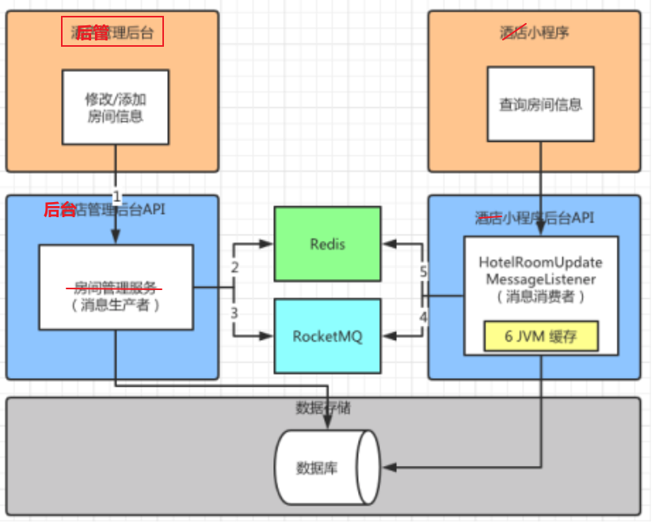

1. 管理员通过、管理后台对门店信息进行修改或者添加的时候，会调用门店管理服务。

2. 门店管理服务除了对门店进行修改保存到数据库之外，还有一个任务就是将修改后的门店信息保存到Redis缓存中。

3. 在保存信息到Redis之后，门店管理服务还充当了消息的生产者，这里它会发送门店更新的消息到RocketMQ的队列中，以供消费者消费该门店更新消息。

4. 小程序后台的门店管理模块中，会一直监听门店更新的消息。

5. 一旦监听到门店更新消息以后会根据对应的门店ID从Redis中获取房间信息。

6. 保证了JVM和Redis中数据的一致性。

**如何保证最终一致性?**

#### 三、下单

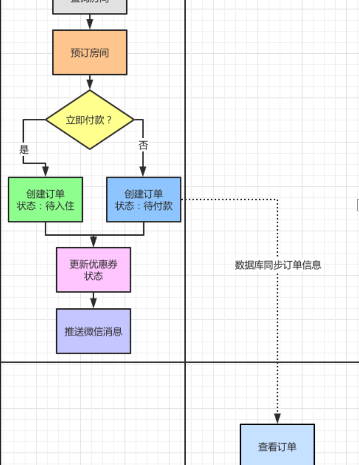

> 1. 加入购物车的逻辑
> 2. 确认下单，生成订单信息，订单状态为待支付
> 3. 保存订单商品信息
> 4. 更新优惠券的使用状态
> 5. 发送订单生成通知（消息类型=微信），消息服务消费消息，通过微信服务通知用户

微信小程序提供消息能力： https://apppukyptrl1086.pc.xiaoe-tech.com/detail/i_603c4542e4b0a77c38983440/1?from=p_5fd03fb3e4b04db7c093b40c&type=6

#### 四、取消订单

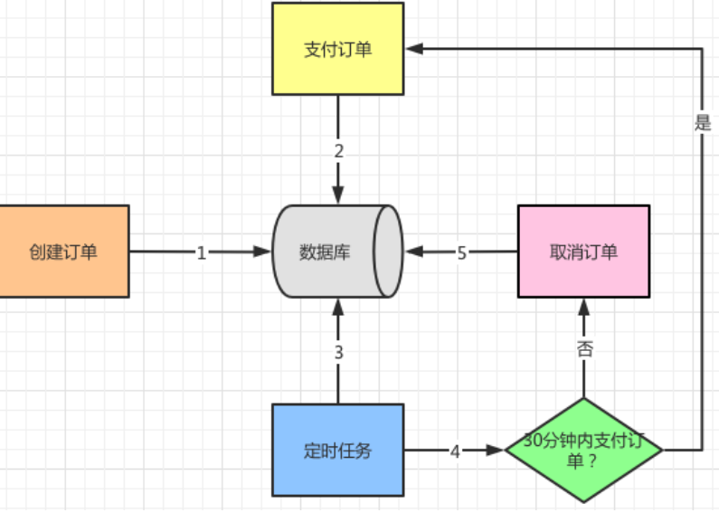

> 1. 创建订单以后，订单信息会保存到数据库中。
> 2. 如果此时有支付订单的行为，一定会更新数据库中订单的状态为“已支付”。
> 3. 定时任务会不断扫描订单表。
> 4. 定时任务在筛选订单数据时会设置两个条件，第一个订单状态是否是“未支付”，第二个是创建订单的时间到当前的时间是否超过了30分钟。只有满足以上两个条件才执行“取消订单”的操作。
> 5. 定时任务调用取消订单的接口，紧接着更新数据库中订单的信息，完成自动取消订单的流程。

###### 通过RocketMQ延迟消息代替定时任务

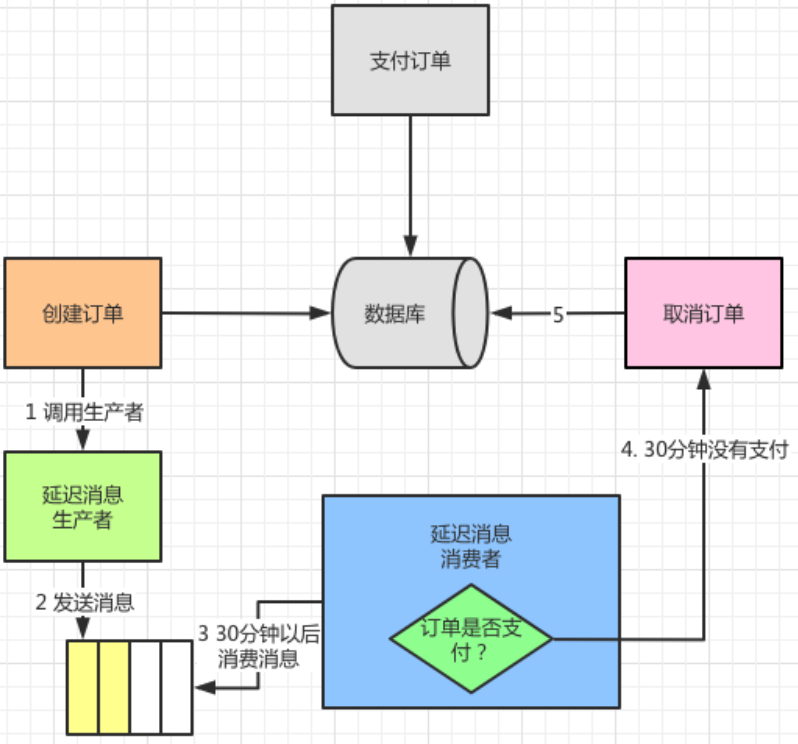

> 1. 订单生成之后通过延迟消息生产者发送延迟消息，也就是上面提到的30分种被消费的订单消息，这个消息会被发送到RocketMQ的队列中。
> 2. 在30分钟的延迟时间以后，延迟消息消费者会获取到这个消息，并且对消息内容进行判断，如果还没有支付。
> 3. 那么就满足了30分种以后依旧没有支付的订单条件，于是执行取消订单的操作。

#### 五、订单支付

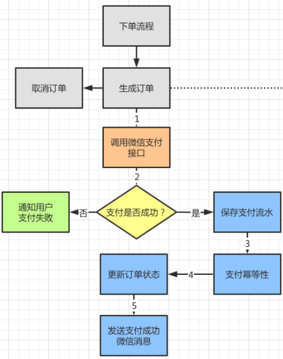

> 1. 在完成订单以后，有两个选择一个是取消订单，另外一个是支付订单。在点击“支付订单”按钮的时候，首先会调用微信支付接口，由于是第三方接口需要等待接口返回支付是否成功。
> 2. 在获得微信支付的回调以后，会判断支付是否成功。如果失败就通知用户，如果成功就会保存支付的流水信息。
> 3. 此后就会进入支付幂等性的判断环节，主要原因是对同一个订单的支付不会重复执行。Key=订单号，Value=订单号+电话号码
> 4. 支付完成以后会更新订单状态，将其修改为“已支付”的状态。
> 5. 最后还会给客户推送“支付成功”的微信消息推送，依旧会带上对应的支付信息和订单信息作为参考。

###### 微信小程序支付

https://apppukyptrl1086.pc.xiaoe-tech.com/detail/i_603c8987e4b0a77c38984f3d/1?from=p_5fd03fb3e4b04db7c093b40c&type=6

#### 六、退款

> 订单服务和优惠券服务同步调用高度的耦合，当优惠券服务宕机时整个订单退款流程将不可用。
>
> 虽然订单服务和优惠券解耦了，但是存在mq不可用，导致退款消息发送失败情况，需要不断的重试。
>
> 为了解决以上问题，我们提出下面RocketMQ的分布式事务的方案。

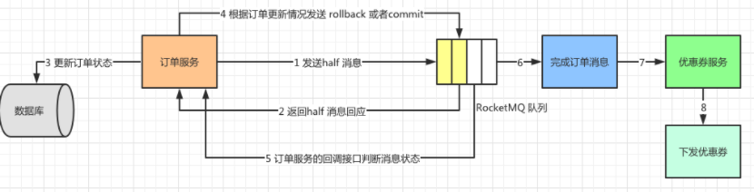

###### 分布式事务

> `在解耦的两个服务的情况下，发送消息的时候要保证两个服务中的操作的一致性，也就是分布式事务`
>
> 1. 订单服务在执行退款订单的时候先向RocketMQ队列发送一个half消息，用来确定MQ的可用性。
> 2. 在接受到half消息以后，MQ会返回一个成功的响应。
> 3. 如果此时MQ不可用，那么订单服务就不需要继续执行更新订单的操作了。假设MQ运行正常，订单服务会去执行本地事务完成“更新订单状态”的操作。
> 4. 订单服务执行的本地事务是否成功，会发给MQ不同的信息。当本地事务成功了，会发送Commit消息，MQ内部会将消息投递到完成订单的topic中，那么优惠券服务可以看到订单服务发送的消息。如果本地事务没有成功，就需要发送rollback消息，告诉MQ删除之前发送的half消息，意思是：“我的事务执行出错了，就当没有这回事，你该干嘛干嘛！”。
> 5. 但是有一种情况，订单服务执行本地事务以后在返回commit或者rollback结果MQ时，由于网络问题MQ没有收到，过一段时间以后MQ就会回调订单服务的接口，判断消息状态，询问是commit消息还是rollback消息。
> 6. 假如订单服务的本地事务执行成功，发送给MQ commit信息。MQ收到以后内部会将消息投递到完成订单的topic中。
> 7. 优惠券服务中会有一个consumer一直监听这个消息。
> 8. 当收到完成订单消息以后就执行下发优惠券的操作，从而保证用户能够收到优惠券。

### MQ中间件应用

#### 1、优化性能

在用户第一次微信登录小程序之后，系统自动给用户发放优惠券。一般的做法都是在微信小程序登录时进行授权，之后判断是否第一次登录，后台再根据判断结果发放优惠券。在课程中将微信登录之后，将其登录消息发送到RocketMQ中之后接着进行后面的业务流程。

由对应的Consumer去处理登录消息，根据业务作出后续的操作，例如：发放优惠券。这种做法提升了登录接口的性能，让其在大流量的场景下处理更多的请求，RocketMQ充当的系统的缓冲区，从而提升系统整体性能。

#### 2、解耦系统

传统的系统架构都是将所有业务逻辑放在一起，通过单应用的方式支撑所有业务。随着业务的复杂度提升，以及大流量高并发的场景频发，导致系统的开发部署都成分布式的趋势。

因此会将系统根据业务进行拆解，按照模块划分应用由于模块运行在不同的进程甚至是服务器，那么模块之间的沟通和信息同步就显得尤为重要，RocketMQ恰恰可以成为这些模块之间的桥梁。

例如用户登录模块处理完登录以后，会往MQ发一条信息，优惠券模块会监听这个信息，进行发放优惠券的操作，而消息通知模块利用这条消息可以发起微信消息通知，告知用户登录的情况。

大家可以发挥想象，利用MQ解耦以后可以让支付模块、物流模块、积分模块各司其职又保持信息沟通的通常。

#### 3、延迟消息

记得在取消订单那个章节提到了在下单超过一定时间（30分钟），用户如果还没有支付，系统会自动取消订单。

传统的做法需要通过Job扫表的方式才能完成以上功能。

有了RocketMQ的延迟消息以后，用户下单预定时就会往MQ中发送一条30分钟的延迟消息，Consumer在30分钟以后接受到消息，判断订单状态是否为待支付，是则取消订单。大大节省了系统轮询的开销，提高系统运行效率。

#### 4、顺序消息

预定客户下单之后，订单数据会推送到MQ供其他系统消费，从而达到进行解耦的目的。而订单状态比如下单成功、支付成功、取消预订、成功入住、成功退房等，会随着用户下单、支付、入住、退房等业务功能被更新，也就是通过订单状态的更新让订单流转起来。

根据订单号发送到RocketMQ订单topic的同一个MessageQueue中，保证订单消息的顺序性，这样消费服务收到的订单消息同样也是有序，保证推送用户订单状态不会错乱，同时可以和系统解耦场景配合起来使用。

#### 5、消息幂等性处理

在系统中经常遇到幂等性的问题，例如：重复登录是否发放多次优惠券、订单支付是否存在重复支付的情况。

在系统设计中我们使用Redis的方式，将这部分信息保存到缓存中，在执行操作的时候从缓存中获取这部分信息，并将其与当前请求信息对比，保证操作的幂等性。保存的信息中把唯一确定记录的信息作为Key，例如：手机号、订单号，将保存的内容作为Value，例如：登录信息、订单信息。

#### 6、事务消息

当RocketMQ连接两个关联性较高的操作时，需要使用事务消息保证事务执行的一致性。记得在退房功能描述的时候，用户完成订单和发放优惠券需要一同完成。

但是由于网络或者MQ可用性等问题，有可能造成一个操作完成，发送消息此时MQ挂掉，导致另外一个操作接受不到消息，从而不能执行后续步骤，最终导致订单完成了但是优惠券没有收到的尴尬局面。

在加入RocketMQ的事物消息以后，完成订单状态更新以后会发送half消息确定MQ运行正常，然后再执行本地事务，在事务提交之后再执行发送消息的操作。这样不仅保证了MQ的可用性，也保证了整个事务的一致性。

### 设计模式运用

###### 简单工厂模式

> 使用`简单工厂模式`重构生成推送客户订单消息：针对不同消息的推送。除了消息类型和消息体内容不同，整个生产消息发送消息的动作都是相同的

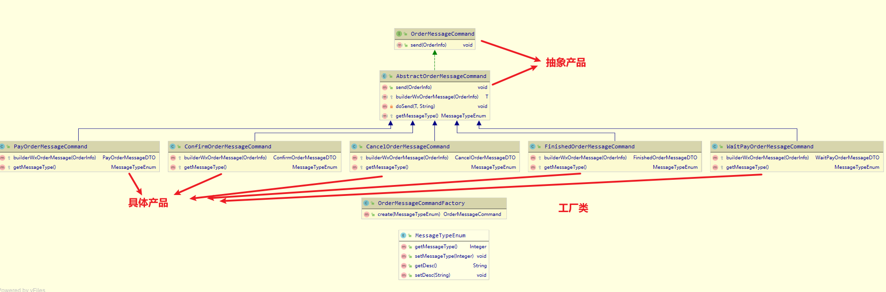

1. 首先，将消息推送功能进行抽象，这里定义了接口OrderMesageCommand，其中定义了抽象方法send，传入参数是OrderInfo。
2. 然后，根据这个接口定义一个Abstract类，这个类需要实现send方法。除了send 方法之外，还定义了两个抽象方法分别是builderWxOrderMessage和getMessageType。builderWxOrderMessage用来实现订单消息体的创建，getMessageType用来设定消息类型（创建订单、取消订单等）。同样这两个方法需要具体的消息类（Command）来实现。
3. 接下来，就是具体消息类的实现了，这里列出了5个消息类，分别代表了5类订单消息推送。WaitPayOrderMessageCommand：创建订单；CancelOrderMessageCommand：取消订单；ConfirmOrderMessageCommand：确认订单；PayOrderMessageCommand：支付订单；FinishedOrderMessageCommand：完成订单。在这5个类中需要实现builderWxOrderMessage和getMessageType方法。
4. 最后，就是OrderMessageCommandFactory类了，它作为工厂类是用来生成不同订单消息（产品）的，其中定义了create方法传入参数是messageTypeEnum，也就是订单类型。返回的结果是OrderMessageCommand，在使用工厂类的时候只需要通过create生成订单类，这个类的实体取决于传入的订单类型参数，然后直接调用OrderMessageCommand的send方法就完成消息发送。

###### 模板方法模式

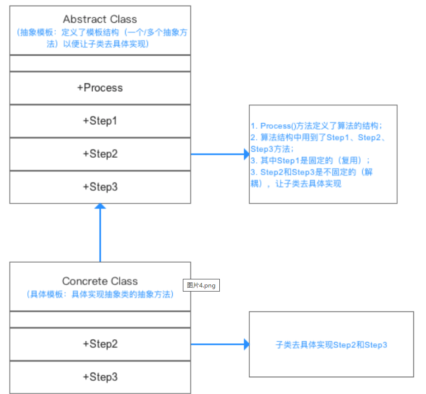

> 有了工厂模式以后就可以根据不同订单生成对应的消息推送，有新的订单消息就建立一个新的command和对应的订单类型，在工厂中定义对应的订单实现类，工厂可以根据订单类型生产出对应的订单消息类。
>
> 订单消息发送的过程，分别是：生成订单消息体和发送消息。可以将这两个步骤进行抽象，让具体的订单实现类完成自身消息体的构建就可以了。通过模板方法模式进行重构

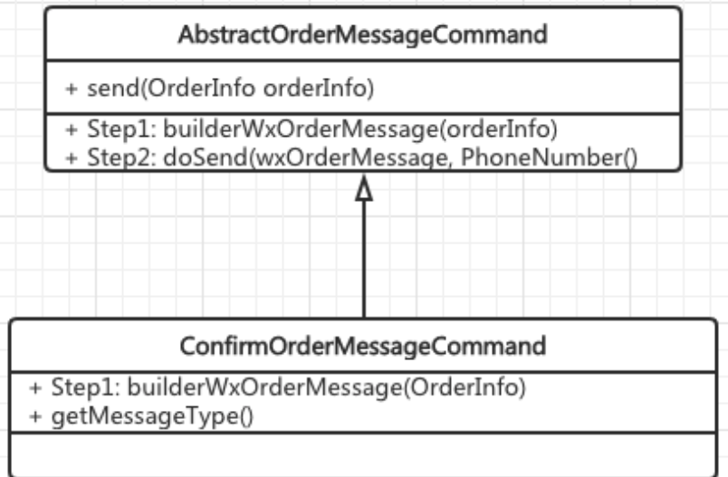

1. 在AbstractOrderMessageCommand中定义了发送方法send，可以理解为模版方法中的算法接口，其包括两个Step：Step1 通过builderWxOrderMessage创建订单消息体，Step2 调用微信推送的API发送消息。
2. 对于Step2 来说是微信发送的通用方法，因此可以放到AbstractOrderMessageCommand中实现，对于具体的实现类不用关系。对于Step1 来说，需要实现类创建对应的消息体，因此ConfirmOrderMessageCommand作为具体的消息推送实现类就需要实现builderWxOrderMessage方法。